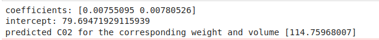

# Implementation of Multivariate Linear Regression
## Aim
To write a python program to implement multivariate linear regression and predict the output.
## Equipment’s required:
1.	Hardware – PCs
2.	Anaconda – Python 3.7 Installation / Moodle-Code Runner
## Algorithm:
### Step1
import pandas
### Step2
read csv file

### Step3
get data from the csv file

### Step4
use linearregression and linearfit 

### Step5
print output

## Program:
```python
import pandas as pd
from sklearn import linear_model

data=pd.read_csv("cars.csv")

X=data[["Weight","Volume"]]
Y=data["CO2"]

regr=linear_model.LinearRegression()
regr.fit(X,Y)

print("coefficients:",regr.coef_)
print("intercept:",regr.intercept_)

predictC=regr.predict([[3300,1300]])
print('predicted C02 for the corresponding weight and volume',predictC)

```
## Output:


## Result
Thus the multivariate linear regression is implemented and predicted the output using python program.